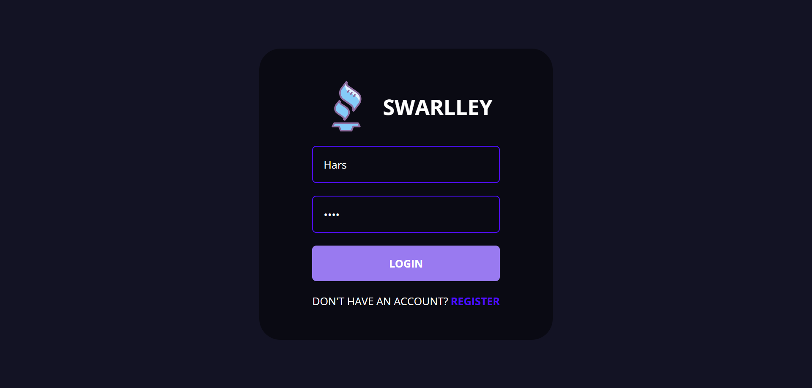
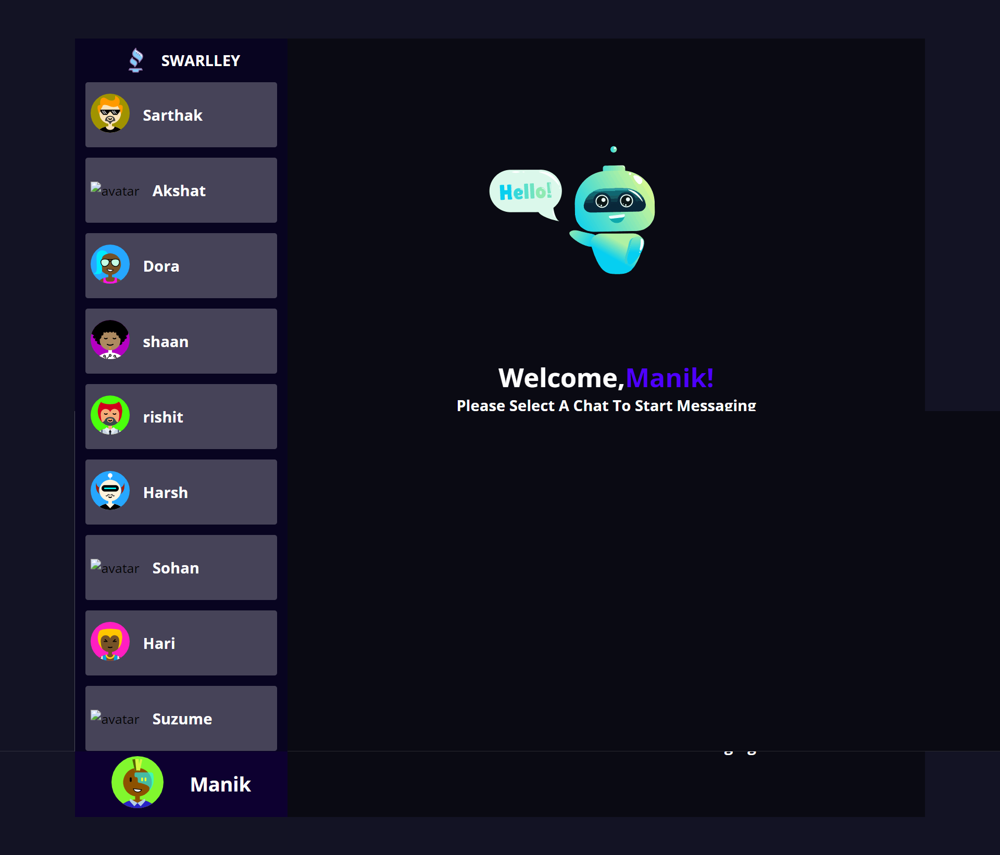
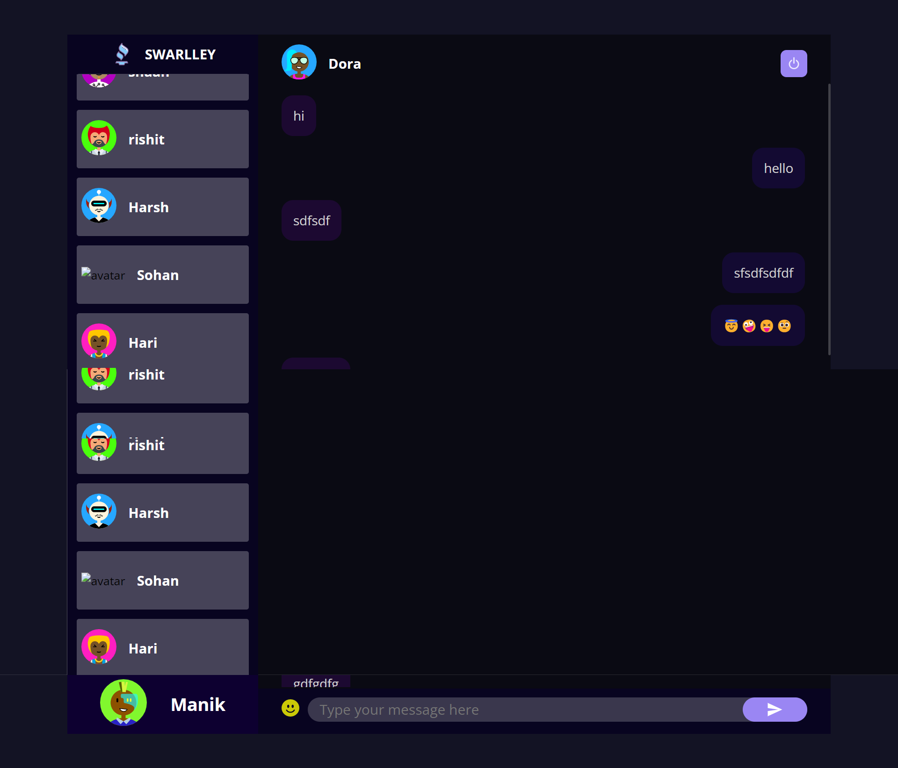

# Swarlley
* https://swarlley.onrender.com


Swarlley is an online real-time chat application built using the MERN (MongoDB, Express, React, Node.js) stack. The application provides users with a platform to register, log in, and chat with other users in real-time.

With Swarlley, users can create a profile, upload a profile picture, and customize their username. Users can then search for other users by username and send them direct messages. The application also features group chat functionality, allowing users to create or join groups and chat with multiple users at once.

Swarlley is designed to be fast, user-friendly, and responsive. The chat interface is sleek and modern, featuring real-time message delivery and read receipts. The application is also secure, with user authentication and encryption to protect user data and messages.

Swarlley is an ideal platform for socializing, networking, and collaborating with other users in real-time. Whether you are looking to connect with friends, meet new people, or collaborate on projects, Swarlley provides a seamless and intuitive way to stay connected and chat with others online.

## Getting Started
***
* Navigate to the "master" branch of the repository
 ```
 git clone -b master https://github.com/ManikDeepak/Swarlley.git
cd Swarlley
```
* Once the app is cloned, the user will need to navigate to both the public and server folders to run the app. Provide the following instructions:
 ``` 
 cd public
 npm install
 npm start
 ```

``` 
cd server
npm install
npm start
```

## Screenshots

>Login Page


>DashBoard


>Chat

